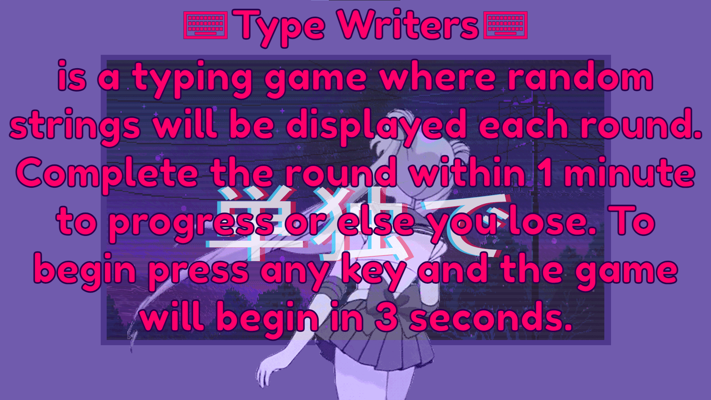
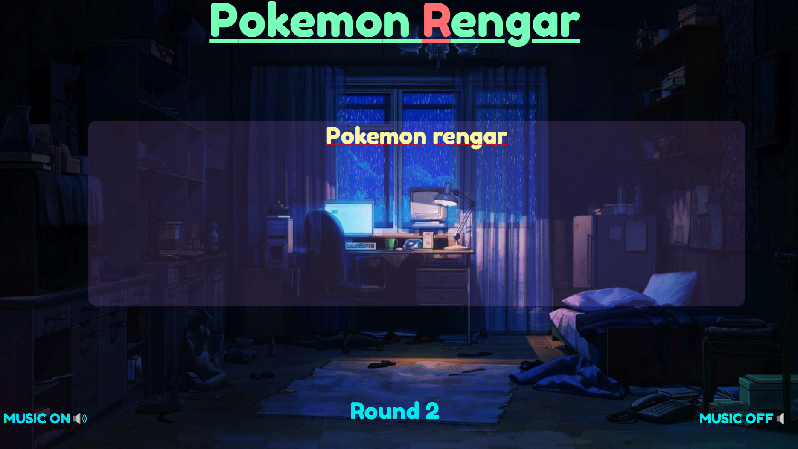
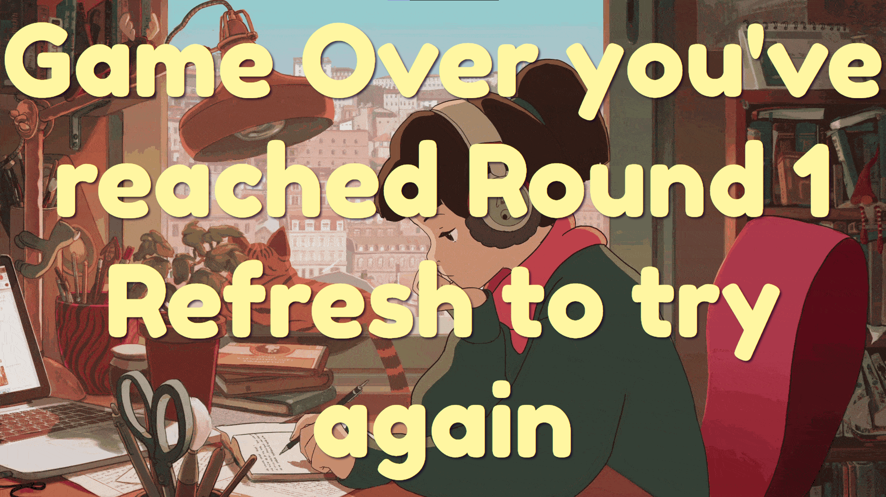

# GAP1
Text based Simon Says game aka Telephone

## Game Overview
Simon says is a memorization game that involves the player replicating patterns that grow each round eg.1st round is "red,blue,green" so the 2nd round will be "red,blue,green,yellow" 

This process will continue until the player makes a mistake and then it is game over. 

My take on this game will be text based and asks the player to input a string that is created and gets longer each round.

the words will be pulled from a wordbank.

Note that generated strings will only be shown for the player at the beginning of each round for a few seconds.

The players will then have to input to the best of the skills the string that was shown shortly with out error in order to progress the round.

## User Stories
- "As a player I want an interactive way to build upon my typing skills"
- "As a player I want to help improve my memorization skills"
- "As a player I would like a system to alert me of any typos I make during the game"
- "As a player I would like a button to start/restart the game"

## Tech used
-JavaScript
    1. async function

    2. timeOut intervals

    3. for-loop

    4. math

    5. DOMmanipulation
-HTML
    1. ID and Classes

    2. Audio

    3. onClick functions
    
-CSS
    1. '-webkit-'

    2. image-background

    3. vh,vw sizing
    
    4. *{ styling }

## Link to deployed version

## MVP GOALS
1. Generate a wordbank/string that the users must replicate in the submission field.
2. I need to create a field where users can input their own text and attempt to build the string that was shown at the start of each round.
3. I should indicate if the users input the correct string and alern them when an error has been submitted.
### In-Game Screen shots

### WireFrame

